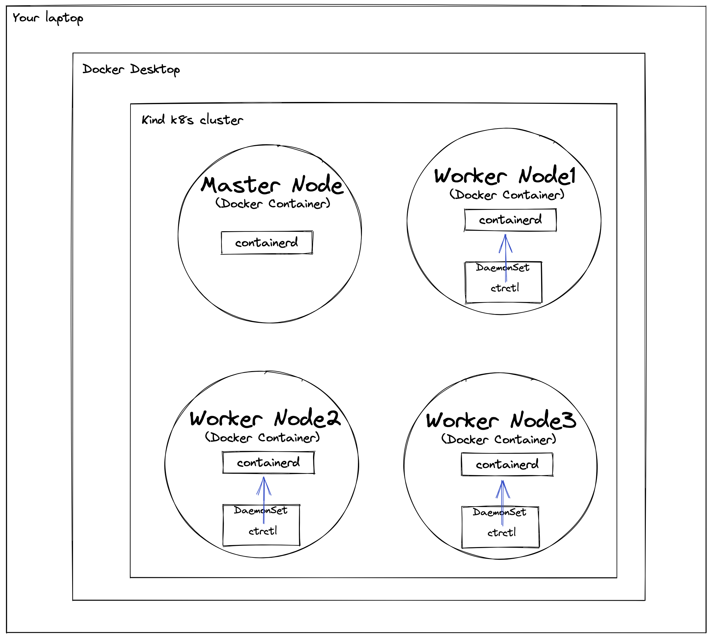

# Setup k8s environment

## Prerequisite

### install Docker Desktop

[https://www.docker.com/products/docker-desktop/](https://www.docker.com/products/docker-desktop/)

### install kind

[https://kind.sigs.k8s.io/docs/user/quick-start/#installation](https://kind.sigs.k8s.io/docs/user/quick-start/#installation)

## Create and Delete a cluster

### create ipv6 cluster

```bash
make setup-v6
```

### create ipv4 cluster

```bash
make setup-v4
```

### delete ipv6 cluster

```bash
make clean-v6
```

### delete ipv4 cluster

```bash
make clean-v4
```

## Docker Registry

### local Docker Registry

#### see image lists

[http://127.0.0.1:55000/v2/_catalog](http://127.0.0.1:55000/v2/_catalog)

#### push a Docker image to local registry

```bash
docker tag your-image:0.0.1 127.0.0.1:55000/your-image:0.0.1

```

#### pull the image from pods in kubernetes cluster

you can access to 127.0.0.1:55000 registry on host by host.docker.internal:55000 in pods.

```bash
docker pull host.docker.internal:55000/your-image:0.0.1
```

### add an insecure registry to the kind cluster

add ghcr.io as insecure registry in assets/kind/kind-v4-with-registry.sh, kind-v6-with-registry.sh
 
```bash
kind: Cluster
apiVersion: kind.x-k8s.io/v1alpha4
containerdConfigPatches:
- |-
  [plugins."io.containerd.grpc.v1.cri".registry.mirrors."${reg_name}:${reg_port}"]
    endpoint = ["http://${reg_name}:${reg_port}"]
  // add an insecure registry
  [plugins."io.containerd.grpc.v1.cri".registry.configs."ghcr.io".tls]
    insecure_skip_verify = true
```

## Samples

build docker image from Dockerfile and push it to local registry

### commands

```bash
cd samples/
docker build -t docker-for-crictl:0.0.1 . --network=host
docker tag docker-for-crictl:0.0.1 127.0.0.1:55000/docker-for-crictl:0.0.1
docker push 127.0.0.1:55000/docker-for-crictl:0.0.1

# create Daemonset on this kind cluster
kubectl apply -f sample-ds-dind.yaml
```
### overview



## Dashboards

you can use kubeapps

[https://github.com/vmware-tanzu/kubeapps/blob/main/site/content/docs/latest/tutorials/getting-started.md](https://github.com/vmware-tanzu/kubeapps/blob/main/site/content/docs/latest/tutorials/getting-started.md)

- install Kubeapps

```bash
helm repo add bitnami https://charts.bitnami.com/bitnami
kubectl create namespace kubeapps
helm install kubeapps --namespace kubeapps bitnami/kubeapps
```

- Create a demo credential with which to access Kubeapps and Kubernetes

```bash
kubectl create --namespace default serviceaccount kubeapps-operator
kubectl create clusterrolebinding kubeapps-operator --clusterrole=cluster-admin --serviceaccount=default:kubeapps-operator
cat <<EOF | kubectl apply -f -
apiVersion: v1
kind: Secret
metadata:
  name: kubeapps-operator-token
  namespace: default
  annotations:
    kubernetes.io/service-account.name: kubeapps-operator
type: kubernetes.io/service-account-token
EOF
```

get the token required to log in this App from browser

```bash
kubectl get --namespace default secret kubeapps-operator-token -o go-template='{{.data.token | base64decode}}'
```

to access from your local environment, you can use port-forward

```bash
kubectl port-forward -n kubeapps svc/kubeapps 8080:80
```


## Creating JFrog artifactory

```bash
kubectl create ns ame
helm repo add jfrog https://charts.jfrog.io/
helm install -name artifactory jfrog/artifactory
```

[https://www.jfrog.com/confluence/display/JFROG/QuickStart+Guide%3A+Maven+and+Gradle](https://www.jfrog.com/confluence/display/JFROG/QuickStart+Guide%3A+Maven+and+Gradle)


## Memos

Docker image of Kubernetes

[https://github.com/kubernetes-sigs/kind/blob/main/images/base/Dockerfile](https://github.com/kubernetes-sigs/kind/blob/main/images/base/Dockerfile)


## Reference

### document of Kind 

[https://kind.sigs.k8s.io/docs/user/quick-start/](https://kind.sigs.k8s.io/docs/user/quick-start/)
